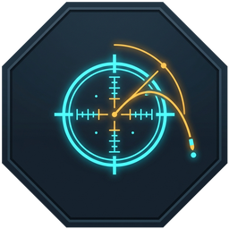
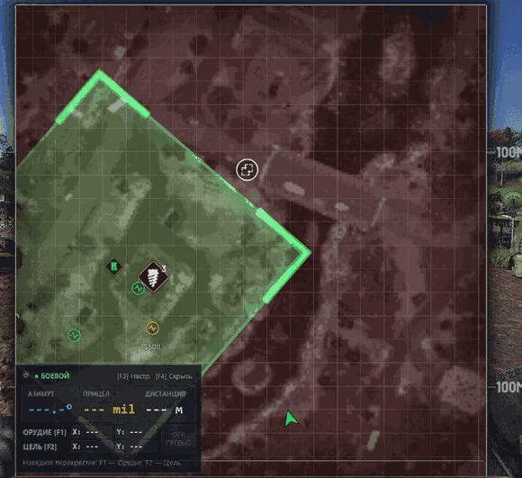
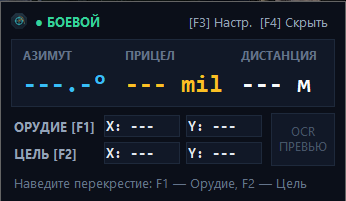
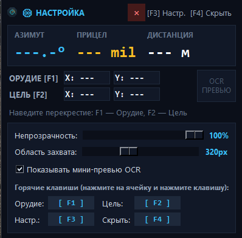

<div align="center">
  

  # Wardogs Mortar Calculator

  **Компактный тактический HUD-оверлей для автоматического расчёта азимута, дистанции и прицела (mil) миномёта в игре WARDOGS.**

  [](#системные-требования)
  [](https://www.python.org/)
  [](LICENSE)
</div>

---

## О проекте

**Wardogs Mortar Calculator** — это легковесный экранный оверлей для расчёта параметров стрельбы с помощью миномёта в игре WARDOGS. По нажатию горячей клавиши утилита захватывает область вокруг курсора мыши на карте, распознаёт текущие координаты перекрестия (`X` / `Y`) с помощью системного движка Windows OCR и мгновенно вычисляет данные для наводки миномёта.

### Основные возможности
* **Сквозной режим** — окно оверлея располагается поверх игры и полностью пропускает сквозь себя клики и движения мыши, не мешая управлению.
* **Мгновенный расчёт наводки** — автоматическое вычисление азимута с точностью до `0.1°`, дистанции в метрах и угла возвышения прицела в `mil` (рабочая дальность `80–684 м`).
* **Гибкая настройка интерфейса** — регулировка прозрачности окна (`20%–100%`), настройка размера зоны захвата вокруг курсора, свободное перемещение оверлея по экрану и мини-превью области распознавания.
* **Привязка клавиш** — переназначение управления в один клик с поддержкой клавиатуры (`F1–F12`, `A–Z`, `0–9`, `NumPad`, модификаторы) и дополнительных кнопок мыши (`MOUSE4`, `MOUSE5`, `MMB`).
* **Минимальное потребление ресурсов** — использование нативных библиотек Windows обеспечивает мгновенный отклик, около `22 МБ` в оперативной памяти и отсутствие нагрузки на процессор в режиме ожидания.

---

## Демонстрация работы

<!-- Поместите записанную GIF-анимацию в папку docs/demo.gif -->
<div align="center">
  
  <p><i>Быстрый захват координат орудия (F1) и цели (F2) прямо на тактической карте</i></p>
</div>

### Скриншоты интерфейса

<!-- Поместите скриншоты в папку docs/ под именами screenshot_combat.png и screenshot_settings.png -->
| Боевой сквозной режим (поверх игры) | Режим настройки и привязки клавиш (`F3`) |
| :---: | :---: |
|  |  |
| *Компактный HUD пропускает клики мыши сквозь себя* | *Настройка прозрачности, области захвата и хоткеев* |

---

## Политика честной игры и безопасность

**Wardogs Mortar Calculator не является читом, модификацией или средством получения запрещённого игрового преимущества.**

* Программа является внешним вспомогательным инструментом — функциональным аналогом общепринятых веб-калькуляторов артиллерии, исключающим необходимость вручную сворачивать игру или переносить координаты во второй монитор или на смартфон.
* ПО функционирует строго как независимое приложение Windows. Оно **не** внедряет сторонний код, **не** модифицирует исполняемые файлы игры, **не** перехватывает сетевые пакеты и **не** читает память процесса. 
* Считывание координат производится исключительно оптическим методом (OCR) из графического буфера экрана вокруг курсора мыши — точно так же, как если бы координаты считывал сам игрок глазами.
* Благодаря отсутствию вмешательства в структуры игры программа не триггерит античит-системы по сигнатурам вмешательства в память. Тем не менее, проект является сторонней любительской разработкой: разработчик калькулятора не связан с авторами WARDOGS и не несет ответственности за изменения в правилах и лицензионных соглашениях сторонних платформ.

---

## Системные требования

* **Операционная система:** Windows 10 (сборка 1809 или новее) / Windows 11 (64-bit).
* **Языковой пакет OCR:** в системе должен быть установлен языковой пакет **Английский (English)** с поддержкой оптического распознавания текста для работы системного компонента `Windows.Media.Ocr` *(Параметры Windows → Время и язык → Язык и регион)*.
* **Режим экрана в игре:** **«Оконный без рамки» (Borderless Windowed)** или **«Оконный» (Windowed)**. В эксклюзивном полноэкранном режиме (`Exclusive Fullscreen`) Windows блокирует вывод сторонних окон поверх игры.
* **Права доступа:** если клиент игры запущен от имени Администратора, калькулятор также необходимо запускать от имени Администратора для корректной работы горячих клавиш.

---

## Управление

| Клавиша (по умолч.) | Действие | Описание |
| :---: | :--- | :--- |
| **`F1`** | **Позиция орудия** | Считывает координаты `X` и `Y` около курсора мыши и сохраняет точку стояния миномёта. |
| **`F2`** | **Позиция цели** | Считывает координаты `X` и `Y` цели и рассчитывает **Азимут (`°`)**, **Прицел (`mil`)** и **Дистанцию (`м`)**. |
| **`F3`** | **Режим настройки** | Переключает оверлей между сквозным боевым режимом и кликабельным режимом настройки (перемещение окна, прозрачность, ручной ввод координат, переназначение клавиш). |
| **`F4`** | **Скрыть / Показать** | Скрывает или возвращает окно оверлея на экран. |

---

## Установка и запуск

### Готовая сборка (Рекомендуется)
1. Скачайте последний исполняемый файл из раздела [**Releases**](../../releases).
2. Запустите `WarDogs_Calculator.exe` (установка Python и дополнительных библиотек не требуется).

### Запуск из исходного кода

> **Требование:** Установленный интерпретатор [Python 3.11+](https://www.python.org/downloads/) (при установке обязательно отметьте галочку **«Add python.exe to PATH»**).

```powershell
git clone https://github.com/ProDexortie/wardogs-mortar-calculator.git
cd wardogs-mortar-calculator

python -m venv .venv
.\.venv\Scripts\activate
pip install -r requirements.txt

python main_lite.py
```

---

## Сборка

Сборка автономного `.exe` файла (через скрипт `build_exe.bat` или вручную):
```powershell
pip install pyinstaller
pyinstaller --noconfirm --onefile --windowed --name WarDogs_Calculator --icon="icon.ico" --add-data "icon.ico;." --add-data "logo.png;." main_lite.py
```

---

## Лицензия

Проект распространяется на условиях лицензии [MIT](LICENSE).
